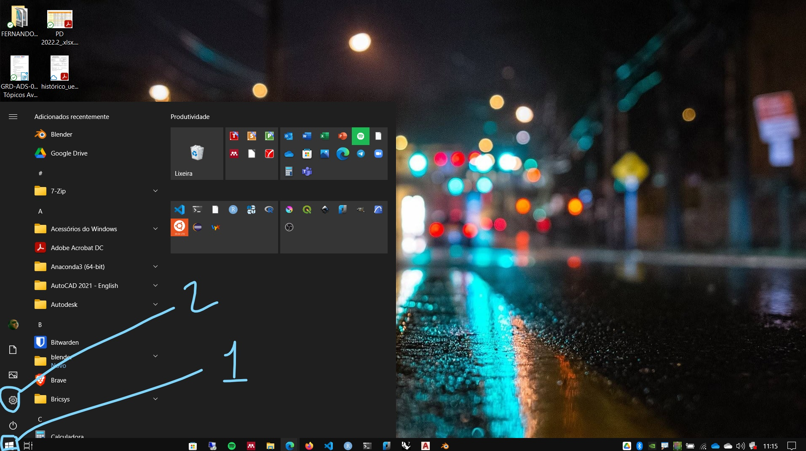
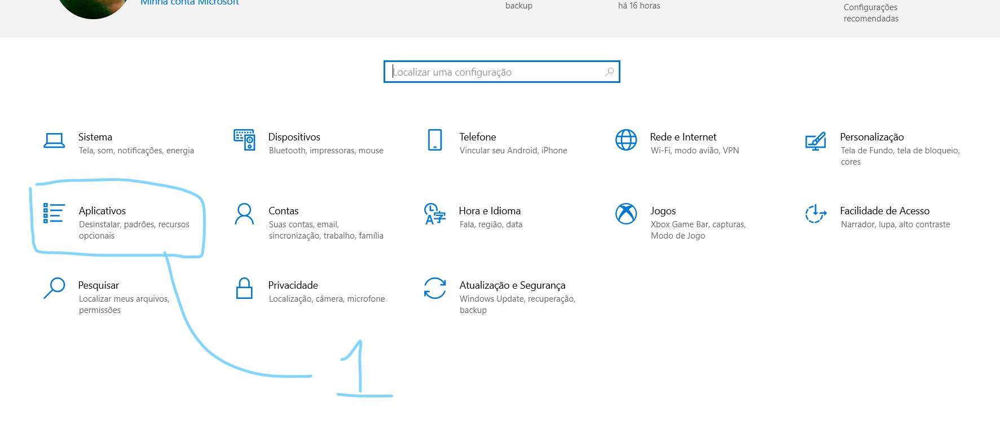
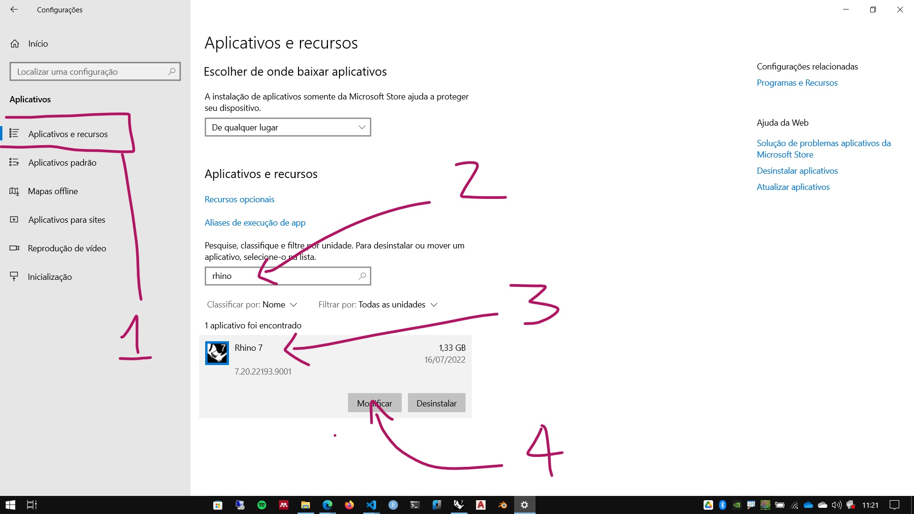
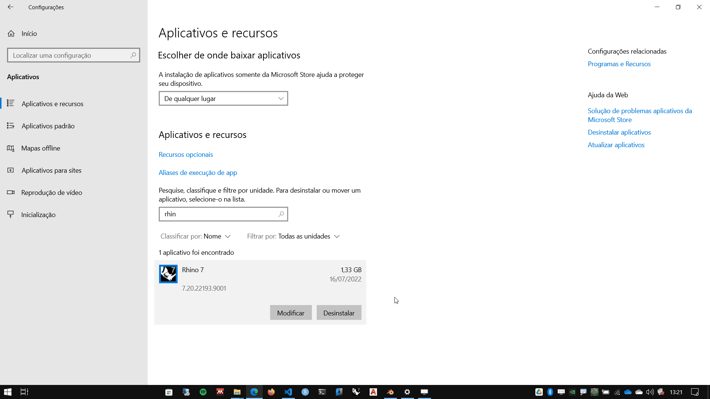
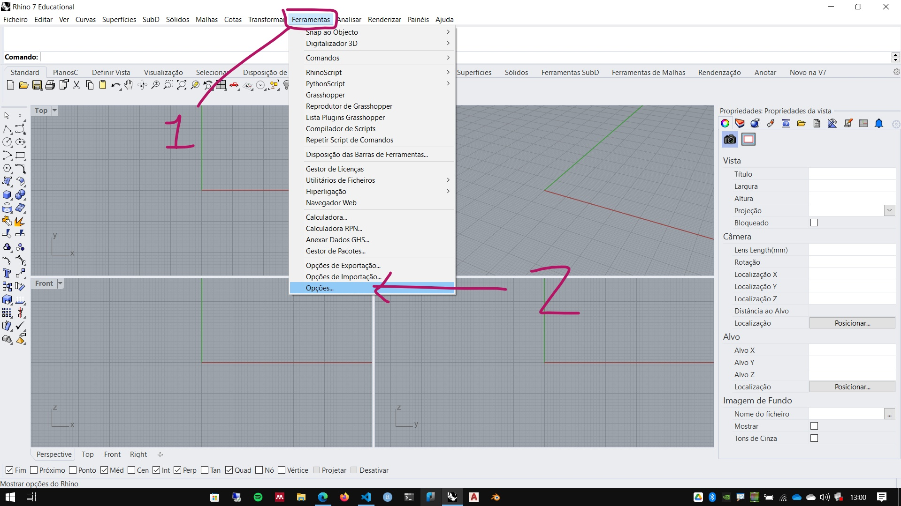
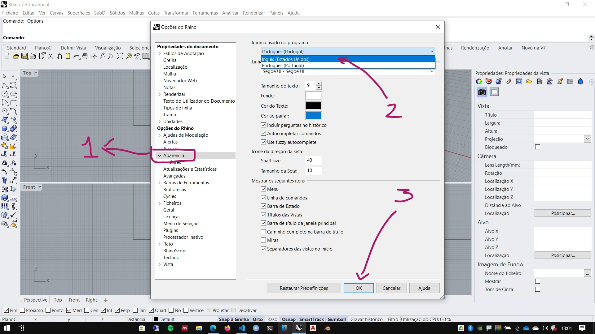

# Adicionando pacotes de idioma no Rhinoceros 3D

Para adicionar pacotes de idioma no Rhino 6 ou 7, siga os passos abaixo:

1. No Windows abras as configurações (ou o painel de controle)

    

1. Escolha a opção dos aplicativos

    

1. Na aba de **Aplicativos e recursos**, procure a versão do Rhino que deseja instalar um pacote de idioma. Clique no ícone do programa, em seguida clique em **Modificar**.

    

1. Selecione a opção para modificar a instalação do Rhino

1. Cliqueno botão **Selecionar idiomas**

1. Selecione o(s) idioma(s) que você quer instalar e clique em **Fechar**.

1. Clique em **Instalar agora**. O instalador vai baixar os pacotes de idioma (é preciso ter conexão com internet ativa).

    

2. Abra o Rhino, vá me **Ferramentas -> Opções**.

    

3. Na aba lateral de **Aparência**, selecione o idioma desejado e aperte ok

    

4. Reinicie o Rhinoceros para ativar as configurações.