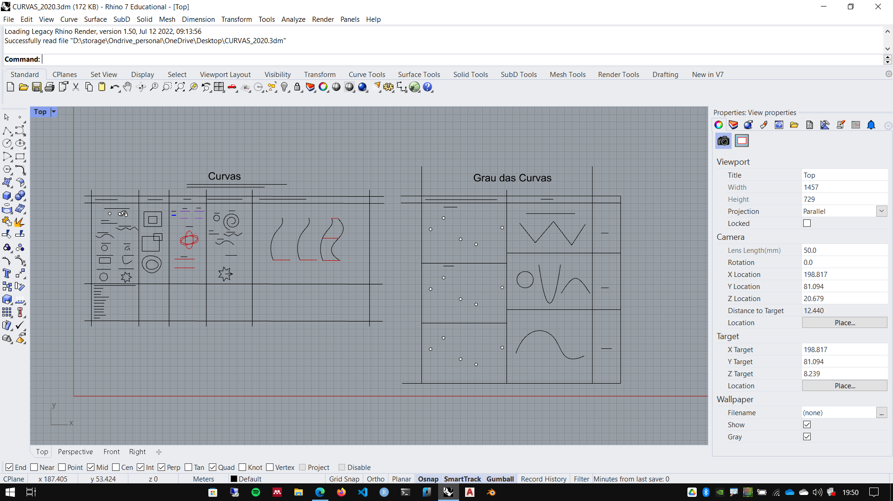

# Pontos e Curvas

[arquivo exemplo](./CURVAS_2020.3dm)

## Criando curvas

### 2D 

1. Line(l)
1. polyline(pl)
1. rectangle(rec)
1. circle(c)
1. arc(a)
1. polygon(pol)
1. parabola(par)
1. hyperbola(hyp)
1. conic(cn)
1. Catenary(cat)

### 3D

1. Helix(hx)
1. Spiral(srl)

## Edição de curvas

1. offset(o)
1. trim(tr)
1. fillet(f)
1. chamfer(cha)
1. extend(ex)
1. rotate(ro)
1. rotate3d(r3)
1. scale(sc)
1. move(m)
1. copy(co)
1. explode(x)
1. join(j)

