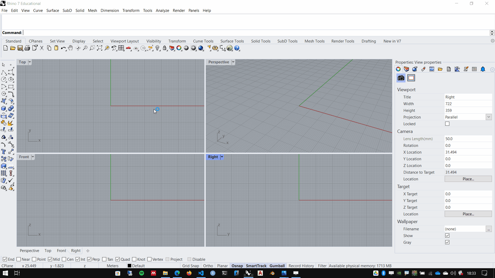
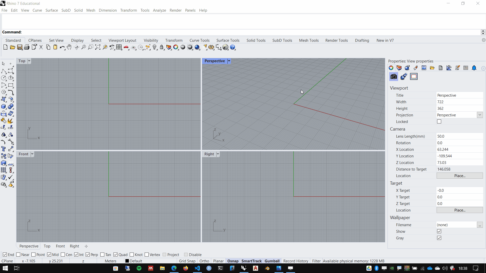

# Interface do Rhinoceros

## Principais elementos da interface

1. Main menu
2. command line
3. Standard Toolbar Group
4. Sidebar
5. Viewports
6. Viewports tabs
7. Osnap
8. Status bar
9. Panels

## Viewports

Maximizando e minimizando **Viewports**:

- Duplo clique no título da **Viewport**

## Viewports shading mode

Mudando o modo de visualização de uma **Viewport**:

- Clique simples na seta ao lado do título da **Viewport**.
- Selecione modo de visualização adequado.

