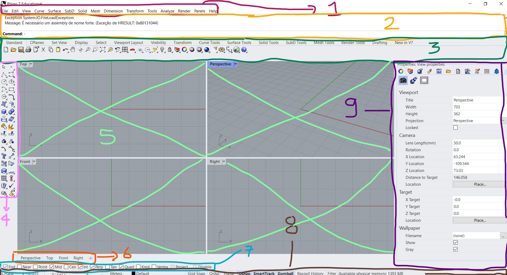

# Interface do Rhinoceros


## Principais elementos da interface



1. Main menu (menu principal)
2. command line (linha de comando)
3. Standard Toolbar Group
4. Sidebar
5. Viewports
6. Viewports tabs
7. Osnap
8. Status bar
9. Panels

## Viewports

Maximizando e minimizando **Viewports**:

- Duplo clique no título da **Viewport**


## Viewports shading mode

Mudando o modo de visualização de uma **Viewport**:

- Clique simples na seta ao lado do título da **Viewport**.
- Selecione modo de visualização adequado.


## Navegação

## Chamada de comandos

## Precisão

### Sistemas de coordenaas

1. Cartesianas
2. Polares

#### Absoluta


1. Cartesiana
    ``` 2.4,7.3,0 ```
2. Polar
    ``` 3.7<30 ```

#### Relativa

1. Cartesiana
    ``` @2.4,7.3,0 ```
2. Polar
    ``` @3.7<30 ```

### Osnaps


### Gumball